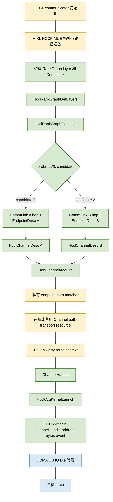

# A5 CCU route2 路径选择定位与显式 relay 改造边界

## 1. 结论

现有证据已经把 route0 与 route2 的路径分叉范围定位到：

```text
communicator 初始化并构造 RankGraph
        |
        |  生成不同 CommLink 和 path-specific EndpointDesc
        v
HcclRankGraphGetLayers / HcclRankGraphGetLinks
        |
        |  probe 只选择已有 candidate，不创建路径
        v
HcclChannelDesc
        |
        |  localEndpoint / remoteEndpoint 不同
        v
HcclChannelAcquire
        |
        |  私有 HCOMM/HCCP/MUE endpoint/path matcher
        v
Channel 内部 path/transport resource
        |
        |  TP/TPG/jetty/route context 的具体组合公开不可见
        v
ChannelHandle
        |
        v
CCU WriteNb
        |
        v
UDMA/UB/IO Die 数据面
```

当前能够严谨确认的**第一处差异**是 RankGraph 发布的 `CommLink`，尤其是完整的
`srcEndpointDesc/dstEndpointDesc`。当前公开追踪没有在 `GET_TP_LIST`、公开 TP attr 或
`WriteNb` 参数中找到稳定的路径 selector。因此，路径不是由 `WriteNb` 临时决定，也不是由应用把整数
`route2` 传给 URMA 后决定。

如果目标是复用 route2 这类已经存在的 forwarding path，不需要修改 UBUS 全局路由表。需要修改或暴露的是：

> **RankGraph 生成之前的 path provisioning，以及 `EndpointDesc -> 私有 path/channel object` 的绑定控制面。**

换句话说，需要让 HIXL/HCCP/MUE 根据 `src、relay、dst` 选择或创建一个 forwarding path object，再为它生成
path-specific endpoint identity 和 `CommLink`；随后现有的 `HcclChannelAcquire -> ChannelHandle -> WriteNb`
数据面可以继续复用。

## 2. route0 与 route2 的编号边界

本文中的 route0/route2 是 probe 对 `HcclRankGraphGetLinks` 返回候选的本地 ordinal：

```text
route0 = candidates[0]
route2 = candidates[2]
```

它们不等于：

- UDMA `route_addr_idx` 0/2；
- UBUS route table index 0/2；
- TP/TPG ID 0/2；
- relay 卡 0/2；
- 用户可写的硬件 path ID。

代码进入 HCOMM 后不会继续传递整数 `0` 或 `2`。继续向下传递的是选中 `CommLink` 的完整 endpoint、协议及
channel descriptor。

## 3. 从 RankGraph 到数据搬运的完整流程



图中绿色节点有公开 API、仓库代码或实机日志支持；黄色节点表示路径建立的私有控制面，正是当前需要暴露或修改的
范围。数据面在获得 `ChannelHandle` 后不再携带 relay 参数。

### 3.1 RankGraph 读取

仓库位置：

- `examples/a5_ccu_urma_route_probe/op_host/utils.cc`
- `EnumeratePaths`
- `SelectRoute`

调用链：

```text
HcclRankGraphGetLayers
  -> 对每个 layer 调 HcclRankGraphGetLinks
  -> 过滤 COMM_PROTOCOL_UBC_CTP
  -> 得到 CommLink candidate
```

这一步是读取 communicator 初始化阶段已经生成的 RankGraph，不是在现场计算或写入物理路由。

### 3.2 从 CommLink 生成 ChannelDesc

当前代码只执行：

```cpp
desc->remoteRank = peer;
desc->notifyNum = CHANNEL_NOTIFY_NUM;
desc->channelProtocol = selectedLink.linkAttr.linkProtocol;
desc->localEndpoint = selectedLink.srcEndpointDesc;
desc->remoteEndpoint = selectedLink.dstEndpointDesc;
```

这里没有 `relayRank`、`nextHop`、`hopList` 或 `route_addr_idx`。route0 与 route2 的稳定公开差异来自选中的
`CommLink`，尤其是两个完整 `EndpointDesc`。

### 3.3 Channel 获取

```text
HcclThreadAcquireWithStream(COMM_ENGINE_CCU)
  -> HcclChannelAcquire(COMM_ENGINE_CCU, HcclChannelDesc)
  -> HcommChannelGetStatus
  -> ChannelHandle
```

`HcclChannelAcquire` 是当前已知分叉输入和数据面句柄之间的关键黑盒。调用 API 相同，但 route0/route2 传入的
`HcclChannelDesc` 不同。底层必须消费这些 endpoint/path 信息，选择或取得不同的内部通信资源。

### 3.4 URMA 与 TP 观察边界

黑箱已经确认：

```text
TpMgr::StartGetTpInfoListRequest
  -> RaGetTpInfoListAsync
  -> RaHdcGetTpInfoListAsync
  -> RsGetTpInfoList
  -> RsUbGetTpInfoList
  -> RsUrmaGetTpList
  -> urma_get_tp_list
  -> ubcore_get_tp_list_helper
  -> ubcore_get_tp_list_from_ops
  -> udma_get_tp_list
  -> MUE firmware
```

UDMA `GET_TP_LIST`：

- service version：1；
- service type：1；
- opcode：`0x21`；
- 请求前 32 字节为 `local_eid[16] + peer_eid[16]`。

公开请求没有 relay rank、next hop 或 hop-list。重复实验中，route0/route2 可得到相同的公开 EID pair、TP
handle 集合和 TP attr。因此 `GET_TP_LIST` 更接近 TP 资源池枚举，不是当前证据下的路径分叉点。

曾观察到的 `urma_import_jfr_ex -> active TP/TPN` 事件必须按 caller stack 排除 Ascend Trace/HDC 基础设施噪声。
在无法证明事件属于单次 `HcclChannelAcquire` 时，不能用这些 TPN 宣称 route0/route2 已稳定绑定不同 TP。

### 3.5 CCU 数据面

数据面只消费已创建的 channel：

```cpp
WriteNb(channel, remoteAddr, localAddr, bytes, event);
WaitEvent(event);
```

`WriteNb` 没有 endpoint、relay、route index 或 hop-list 参数。因此，在执行到它以前，路径必须已经固化在
`ChannelHandle` 引用的内部资源中。

## 4. 路径选择差异可能由哪些参数造成

下面按证据强度排序。列表中的“可能”不等于已经证明可编程。

| 优先级 | 参数或上下文 | 所在阶段 | 当前证据 | 对路径选择的可能作用 |
|---|---|---|---|---|
| P0 | 完整 `srcEndpointDesc` / `dstEndpointDesc` raw | CommLink、ChannelDesc | route0/route2 稳定不同，并原样进入 Acquire | 最可信的 path identity 或 matcher key |
| P0 | `CommAddr.type + CommAddr.eid[16]` | EndpointDesc | 两个 candidate 的完整地址不同 | 指向预配置 endpoint/path identity；不是公开 hop-list |
| P0 | RankGraph layer、link identity、`hop` | CommLink 构造前后 | route0 为 hop-1，route2 为 hop-2 | 参与上游 path provisioning；其中 `hop` 也可能只是描述结果 |
| P0 | communicator 内部 RankGraph/path catalog 上下文 | communicator 初始化 | GetLayers/GetLinks 只读取已发布结果 | 将 endpoint identity 关联到私有 path object |
| P1 | `HcclChannelDesc` 私有/raw 字段 | Acquire 输入 | descriptor raw 随 endpoint 差异变化 | 可能携带公开结构未命名的内部标记 |
| P1 | HCCP/MUE endpoint matcher 的隐式上下文 | Acquire 内部 | 公开 URMA 边界无法解释路径差异 | 很可能选择预配置 Channel/path/TPG 对象 |
| P1 | local/remote EID pair 与 service/trans mode | HCCP 到 MUE | GET_TP_LIST 明确携带 EID pair | 用于查 TP pool；单独不足以解释已观测路径差异 |
| P1 | remote ID、UASID、TPN/TPG、jetty identity | import/connect | 数据结构和部分事件可见，但与 candidate 的稳定绑定未完全证明 | 可能是私有 path object 的资源引用 |
| P2 | `route_addr_idx` | UDMA TP context | 已确认字段存在，未获得 producer/consumer 映射 | 可能索引 MUE/UDMA path/route object |
| P2 | `route_type`、`switch_mp_en`、`lbi` | UDMA TP context | 字段存在，语义与赋值链未知 | 可能区分 forwarding、multipath 或负载均衡模式 |
| P3 | `flow_label`、UDP source port、`spray_en` | TP/packet 属性 | 公开 attr 可见；无显式 relay 语义 | 可能在已有候选出口间 hash/spray，不能创建指定 relay |
| 排除 | probe 的 `routeIndex=0/2` | 测试程序 | 只是数组 ordinal | 不会进入硬件 |
| 排除 | `ChannelHandle` 数值 | Acquire 返回 | opaque handle | 不能从数值推导 TP、relay 或 path |
| 排除 | `sr_en` | TP attr | 已确认是 Selective Retransmission | 不是 source routing |

当前最小、最稳妥的定位是：

```text
路径身份最迟在 ChannelAcquire 返回前确定；
首次可靠差异是 CommLink/EndpointDesc；
实际绑定发生在 RankGraph path provisioning 或 ChannelAcquire 内部 matcher；
公开 GET_TP_LIST 之后没有发现可由应用设置的稳定 selector。
```

## 5. route2 为什么能工作而直接选择 EID 不够

route2 的顺序是：

```text
平台控制面先准备 forwarding path object
  -> 为它生成 path-specific endpoint identity
  -> RankGraph 发布 CommLink
  -> 应用选择 CommLink
  -> HcclChannelAcquire 命中已有 path object
```

直接 EID 实验尝试的是：

```text
应用选择或构造 EID
  -> 希望底层自动推导 relay 和 forwarding path object
```

第二条链缺少 path provisioning 和 endpoint-to-path registration。`urma_get_device_by_eid`、
`urma_create_context` 只能回答本地用户态是否能绑定某个 endpoint identity，不能注册一条
`src -> relay -> dst` 的 forwarding path。

`NOT_VISIBLE` 实验只能证明 RankGraph 使用的部分完整 endpoint identity 没有作为普通用户态本地 EID 暴露；它本身
不是“硬件不能 relay”的证据，也不能说明远端 EID 必须在源卡创建 context。

## 6. 如果不改 UBUS 路由表，显式构造 relay 应该改什么

### 6.1 为什么可以不改全局路由表

黑箱与实机实验已经证明：

- route2 能传输；
- HCCL RankGraph 能发布 hop-2 forwarding CommLink；
- direct 与 forwarding 资源可以并发贡献带宽；
- IO Die transit forwarding 数据面已经存在。

这说明至少一部分 forwarding 路径已经被平台控制面准备好。为了显式复用这些路径，不需要重新写全局
`destination CNA -> egress bitmap`。

需要修改的是“选择或生成哪个既有 forwarding path object，并为上层发布什么 endpoint/CommLink”。

### 6.2 两种实现情况

#### 情况 A：所有需要的 relay path 已经存在，只是没有全部发布

应增加受支持的内部路径目录与选择 API：

```text
EnumeratePathObjects(srcRank, dstRank)
  -> pathHandle
  -> hop count
  -> relay physical rank or physical footprint
  -> local/remote endpoint identity
  -> die/protocol/capacity/status

SelectPathObject(srcRank, dstRank, relayRank)
  -> pathHandle

PublishOrBuildChannelDesc(pathHandle)
  -> CommLink or HcclChannelDesc
```

随后沿用：

```text
HcclChannelAcquire
  -> ChannelHandle
  -> CCU WriteNb
```

这里真正需要改的是 HIXL/HCCP/MUE 的 path catalog 查询与 HCOMM 的 path-object 绑定接口，而不是 CCU kernel。

#### 情况 B：物理 hop 可达，但指定 relay 的 path object 尚未创建

需要增加 per-path 控制面 API：

```text
CreateForwardingPath(
    srcRank,
    relayRank,
    dstRank,
    protocol=UBC_CTP,
    forwardingOnly=true,
    noRelayHbm=true)
  -> pathHandle
  -> localEndpoint
  -> remoteEndpoint
```

平台内部需要：

1. 验证 `src -> relay` 与 `relay -> dst` 已有物理连通性；
2. 在 HCCP/MUE 中组合或分配 forwarding path/TPG/jetty/route context；
3. 注册 path-specific endpoint identity 与该内部对象的匹配关系；
4. 生成可被 HCOMM 消费的 `CommLink` 或 `HcclChannelDesc`；
5. 管理 path lease、引用计数、查询和销毁；
6. 保证 relay 只使用 IO Die 转发，不启动 relay rank 用户进程，不落 relay HBM。

此处“创建 path object”不等于改 UBUS 的全局 reachability 表。底层可以复用已经存在的每跳物理路由，只新增
**per-channel/per-path 的 forwarding 组合和绑定状态**。

### 6.3 建议的最小接口边界

建议把新能力放在 HCOMM 与 HCCP/HIXL 的控制面边界，而不是 Python 或 CCU kernel：

```cpp
struct ExplicitRelayPathRequest {
    uint32_t srcRank;
    uint32_t relayRank;
    uint32_t dstRank;
    CommProtocol protocol;
    uint32_t flags;  // forwarding-only, no-relay-HBM
};

struct ExplicitRelayPathResult {
    uint64_t pathHandle;
    EndpointDesc localEndpoint;
    EndpointDesc remoteEndpoint;
    uint32_t dieId;
    uint32_t hopCount;
};

HcclResult HcommExplicitRelayPathAcquire(
    HcclComm comm,
    const ExplicitRelayPathRequest *request,
    ExplicitRelayPathResult *result);

HcclResult HcommExplicitRelayPathRelease(
    HcclComm comm,
    uint64_t pathHandle);
```

`Acquire` 的 backend 应连接现有 RankGraph/path catalog 和 HCCP/MUE path provisioning；不能通过伪造 EID 或
返回默认 route2 冒充指定 relay 成功。

## 7. 对现有代码应怎样改

### 7.1 不应修改

- 不应给 `WriteNb` 增加一个只在应用层存在的 `relayRank` 参数；数据面无法据此创建路径。
- 不应把 `routeIndex=2` 硬编码成 relay 卡 2。
- 不应把 `route_addr_idx` 猜成 RankGraph ordinal。
- 不应继续把 `GET_TP_LIST` 当作主 selector；它已被证据降级为资源枚举边界。
- 不应仅修改全局 UBUS route table作为生产级 per-channel 选路方案。

### 7.2 应修改

1. **HIXL/HCCP/MUE 控制面**：提供 path object 的枚举、指定 relay 的创建/选择、查询与释放。
2. **HCOMM resource/channel 层**：允许 `HcclChannelAcquire` 绑定一个明确的 `pathHandle`，或消费由该
   pathHandle 生成的 path-specific `EndpointDesc`。
3. **RankGraph 发布层**：可选地把新建 path 发布成带稳定 path identity 和 relay metadata 的 `CommLink`；如果
   不发布，则提供直接从 `pathHandle` 创建 ChannelDesc 的内部接口。
4. **本仓 operator host 层**：把用户的 `relayRank`/path policy 传给新控制面，得到 Channel；继续把
   `ChannelHandle` 传给现有 CCU kernel。
5. **观测与安全层**：返回实际 relay、hop、die、物理 footprint 和 lease；若无法满足指定 relay，必须失败，不能
   静默回退。

现有 CCU 多路径数据面可以继续使用：

```text
channel_direct = acquire(direct pathHandle)
channel_relay  = acquire(explicit relay pathHandle)

WriteNb(channel_direct, directChunk)
WriteNb(channel_relay, relayChunk)
WaitEvent(all)
```

因此工程上的主要缺口不是 AllToAll 切分或 CCU `WriteNb`，而是创建并绑定 `channel_relay` 的控制面。

## 8. 为定位路径分叉已经做过哪些尝试

本节按控制链从上到下记录已经做过的实验。目的是避免重复投入，也避免把一次偶然的 handle/TPN 差异误报成
稳定 selector。

### 8.1 RankGraph 和 CommLink 枚举

**位置：**

```text
HcclRankGraphGetLayers
  -> HcclRankGraphGetLinks
  -> examples/a5_ccu_urma_route_probe/op_host/utils.cc::EnumeratePaths
```

**做法：**逐 layer 枚举 UBC CTP `CommLink`，记录 layer、link、hop、protocol、两端物理卡、die、带宽系数、
完整 `CommAddr` 和 `EndpointDesc` raw。

**结果：**route0 与 route2 在这一层已经不同。route0 是 hop-1 direct candidate；route2 是 hop-2 candidate，且
两端完整 endpoint raw 与 route0 不同。

**结论：**这是目前最早且稳定的公开差异。它证明路径差异在调用 `HcclChannelAcquire` 以前已经存在，但不能说明
RankGraph 中哪个私有字段编码了 relay 卡。

### 8.2 ChannelDesc 完整差分

**位置：**

```text
SelectRoute
  -> HcclChannelDescInit
  -> localEndpoint = CommLink.srcEndpointDesc
  -> remoteEndpoint = CommLink.dstEndpointDesc
  -> HcclChannelAcquire
```

**做法：**在 Acquire 前输出完整 `HcclChannelDesc` raw、endpoint raw、remote rank、protocol 和 notify 数量。

**结果：**调用的 API 和 engine 相同，但 route0/route2 的 `HcclChannelDesc` 并不相同，主要可解释差异来自完整
`localEndpoint/remoteEndpoint`。

**结论：**不能表述为“route0 和 route2 传给 Acquire 的参数相同”。准确说法是：Acquire 的调用形式相同，
但路径相关 descriptor 不同。

### 8.3 `GET_TP_LIST` 多层追踪

**位置：**

```text
HcclChannelAcquire 下游
  -> HCCP TpMgr / Ra / Rs
  -> urma_get_tp_list
  -> urma_cmd_get_tp_list
  -> urma_ioctl_get_tp_list
  -> UDMA CTRLQ GET_TP_LIST opcode 0x21
```

**做法：**通过 `LD_PRELOAD` 和 provider 边界 hook 记录：

- `flag`、`trans_mode`；
- `local_eid`、`peer_eid`；
- 返回 TP handle 集合；
- caller stack；
- `urma_cmd_udrv_priv_t` 的 input/output private blob；
- ioctl command 的前后 raw 数据。

**结果：**

- route0/route2 在可见的 `GET_TP_LIST` 配置中没有稳定的显著差异；
- 同进程重复实验中，两者可获得完全相同的 TP handle 集合；
- 个别运行的 handle 尾号变化会随分配顺序变化，不能作为 path ID；
- 已观察 provider 的 `udata_in_len/udata_out_len` 可以为 0，没有发现隐藏 selector 通过该 private blob 下传。

**结论：**`ChannelDesc` 没有被原样传给 `GET_TP_LIST`。更准确的关系是：Acquire 消费 ChannelDesc，随后其下游
可能调用 `GET_TP_LIST` 查询 TP 资源池；到这个公开边界时，route0/route2 的路径身份已经不再以可见参数形式
出现。因此 `GET_TP_LIST` 不是目前证据下的分叉点，继续只分析它不能找到显式 relay selector。

### 8.4 TP attr 查询和修改接口

**位置：**

```text
urma_get_tp_attr / urma_cmd_get_tp_attr
urma_set_tp_attr / urma_cmd_set_tp_attr
urma_modify_tp / urma_cmd_modify_tp
urma_cmd_exchange_tp_info
```

**做法：**对 `GET_TP_LIST` 返回的每个 handle 主动查询属性，并拦截 SET、MODIFY、EXCHANGE。

**结果：**

- 可查询时，route0/route2 的公开 attr 没有稳定差异；部分字段为零或仅返回有限 bitmap；
- 某些环境直接返回 `not support query TP`；
- `SET_TP_ATTR`、`MODIFY_TP`、`EXCHANGE_TP_INFO` 没有出现可归因于 candidate 的稳定事件；
- `spray_en`、flow label、UDP source port 等字段没有显示出“relay=某物理卡”的语义；
- `sr_en` 已确认是 Selective Retransmission，不是 source routing。

**结论：**公开 TP attr 面没有暴露 route0/route2 的稳定物理路径绑定，不能通过这些字段直接复现指定 relay。

### 8.5 import/bind 和 TP 激活追踪

**位置：**

```text
urma_import_jfr[_ex]
urma_import_jetty[_ex]
urma_bind_jetty[_ex]
```

**做法：**记录 active TP handle、peer TP handle、target TPN、remote ID/EID、caller stack，并给每次 Acquire 添加
trace label。

**结果：**曾观察到 route0/route2 对应不同 TP/TPN 的事件，但调用栈进一步表明其中至少一部分来自：

```text
libascend_trace.so
  -> HDC connect
  -> import_jfr_ex
```

这些属于 Ascend Trace/HDC 基础设施，不能作为 CCU Channel 绑定证据。排除该噪声后，尚未得到稳定、可重复且带
单次 Acquire 标签的 `candidate -> active TP/TPN` 映射。

**结论：**不能把当前捕获到的任意合法 TP/TPN 都解释成 route0/route2 的最终 TP。必须同时满足 Acquire 时间窗口、
trace label 和 HCOMM/HCCP/URMA caller stack 才是有效证据。

### 8.6 同进程正反顺序实验

**位置：**

```text
同一 communicator
  -> candidate 0 后 candidate 2
  -> candidate 2 后 candidate 0
  -> 两个 Channel 同时保持存活
```

**做法：**消除不同进程、communicator 重建和 TP pool 重建带来的影响，比较路径身份与首次/第二次资源分配顺序。

**结果：**公开 TP handle 池可以相同，handle 个别变化与分配顺序相关；实验在 Channel 建链或资源等待处也可能
长时间停顿。

**结论：**handle 数值不是路径身份；同进程实验没有在公开 URMA 边界找到稳定 selector，但进一步把分叉区间
限制在 Acquire 内部对象与其私有控制面。

### 8.7 `urma_admin list_res` 资源快照

**位置：**Channel 存活窗口内的用户态管理查询。

**结果：**当前 provider 对 TP/设备统计返回 `not support query` 或 `no device list`。

**结论：**这只说明管理查询面未开放，不能说明不存在 TP、TPG 或 forwarding path；也不能用于建立
`ChannelHandle -> TP/path` 映射。

### 8.8 完整 EID 可见性实验

**位置：**

```text
urma_str_to_eid
  -> urma_get_device_by_eid
  -> urma_get_eid_list
  -> urma_create_context
```

**做法：**把 RankGraph CommLink 中的完整 endpoint EID 交给普通用户态 URMA 查询和绑定。

**结果：**部分 path-specific EID 返回 `NOT_VISIBLE`。

**结论：**这些 identity 没有作为普通本地 URMA EID 暴露。该实验不能证明远端 EID 必须在源卡创建 context，也
不能单独证明“EID 永远不能参与路径选择”；它证明的是普通用户态 context API 无法复现 RankGraph 的私有
endpoint/path 注册状态。

### 8.9 HCCN 物理 footprint 与性能实验

**位置：**Channel 建立完成后的数据面，比较 candidate-only 和 concurrent 打流期间的端口计数。

**结果：**结合隔离实验，已经得到 route0 为 direct、route2 使用 direct+relay footprint 的结论；但 HCCN
计数器曾受命令模式、背景流量、counter 单位和采样窗口影响，不能把任意一次非端点流量上涨直接命名为 relay。

**结论：**HCCN 能验证一个已建 Channel 实际走了哪些物理资源，但不能解释 `EndpointDesc` 如何绑定到这个
Channel/path object。它属于结果验证，不是控制面 selector 定位工具。

### 8.10 `route_addr_idx` 等 TP context 字段静态分析

**位置：**openEuler/UDMA TP context 与 MUE 相关结构。

**结果：**已经确认存在 `route_addr_idx`、`route_type`、`switch_mp_en`、`lbi`、flow label 等字段，但尚未拿到：

- route0/route2 的可信完整 TP context 对比；
- 字段 producer/consumer；
- 索引表格式；
- host 可写 ABI。

**结论：**这些仍是底层 path binding 的候选字段，但不能把名称当成语义，也不能把 `route2` 的数字映射成
`route_addr_idx=2`。

## 9. 下一步怎样定位 Acquire 到 ChannelHandle 之间的缺失部分

当前缺口不是“`HcclChannelAcquire` 怎样把参数复制进 `ChannelHandle`”。`ChannelHandle` 是 opaque 标识，真正应
定位的是：

```text
HcclChannelDesc 中的哪些字节
        ↓
被哪个内部函数读取
        ↓
形成什么 cache key / LinkData / path request
        ↓
选择或创建哪个内部 path/transport object
        ↓
该对象如何被注册为 ChannelHandle
```

建议按以下优先级执行。

### 9.1 定位 `HcclChannelAcquire` 的真实实现与内部 factory

先使用当前 CANN/HCOMM 版本的二进制，而不是只看头文件：

```text
libhcomm.so / libhccl.so 导出入口
  -> API adapter
  -> communicator resource manager
  -> channel cache lookup
  -> CcuUrmaChannel factory / ConnectChannelsOnce
  -> handle registry insertion
```

需要输出每一跳的共享库、object-relative offset、符号名和调用关系。目标不是反编译全部函数，而是找到：

- 第一次读取 `localEndpoint/remoteEndpoint` 的内部函数；
- Channel cache key 的构造函数；
- 创建 `LinkData` 或连接请求的函数；
- 返回 `ChannelHandle` 前把内部 Channel 注册到 handle table 的函数。

### 9.2 对 EndpointDesc 做差分数据流追踪

route0/route2 的 endpoint raw 已知且不同，可以把它当作天然标记：

1. 在 Acquire 入口保存 descriptor 地址和两段 endpoint raw；
2. 对同进程 route0/route2 分别运行；
3. 在内部调用边界检查哪些参数、内存对象或 hash key仍含这些字节；
4. 找出 endpoint raw 首次被转换、hash、查表或替换成内部 ID 的位置；
5. 对该位置之后的返回对象做 route0/route2 差分。

若能使用调试器或动态插桩，可对 endpoint 地址设置硬件 read watchpoint；若优化后二进制无法 watch，则在
Acquire 子调用边界做有界内存快照和 caller/argument trace。不能用全进程无界内存扫描替代关联分析。

### 9.3 追 Channel cache lookup 与 handle registry

需要分别回答：

```text
不同 EndpointDesc 是否命中不同 cache key？
不同 candidate 是否复用同一个 Channel 对象？
ChannelHandle 是对象地址、registry ID，还是编码句柄？
HcommChannelGetStatus / WriteNb 如何由 handle 找回对象？
```

方法是同时追踪：

- Acquire 返回前的 handle 值；
- `HcommChannelGetStatus(handle)` 的第一层 handle lookup；
- Channel release/destroy 的反向 lookup；
- CCU task 构造时 handle 被写入哪个 device-side context。

这里的目的不是解释 handle 数值，而是通过 lookup 找到它引用的真实对象，再比较对象中的 endpoint、link、TP/jetty、
path 或私有 ID。

### 9.4 追 endpoint matcher 到 HCCP/MUE request 的第一次转换

一旦找到 Channel 内部对象，应继续跟踪：

```text
EndpointDesc
  -> LinkData / endpoint key
  -> HCCP request
  -> remote endpoint/resource exchange
  -> path/TP/TPG/jetty selection
```

重点不是再次记录公开 `GET_TP_LIST`，而是记录它之前的私有请求对象：

- endpoint hash或内部 endpoint ID；
- layer/link/hop/path metadata；
- service type、die、remote rank；
- remote ID、UASID、jetty/TPG identity；
- path object或route resource handle；
- 传给 HDC/CTRLQ 的私有 opcode 与 payload。

如果公开 URMA 参数相同，而上面某个内部请求不同，第一处不同字段就是新的 selector 候选。

### 9.5 对闭源二进制进行最小黑箱差分

如果符号被裁剪，应采用同进程、单变量实验：

```text
固定 communicator、rank pair、engine、protocol、消息长度和调用顺序
唯一改变：CommLink candidate A / B
```

对 `HcclChannelAcquire` 时间窗采集：

- 动态库调用图与 object-relative return address；
- HDC/driver ioctl/CTRLQ opcode、payload 长度和有界 raw；
- 分配/注册对象的地址、大小和生命周期；
- endpoint raw 在子调用参数中的出现位置；
- ChannelHandle 注册前最后一个不同的内部 ID。

只有同时满足“与 Acquire 时间窗相关、正反顺序稳定、排除 HDC trace 噪声”的差异，才可以升级为路径选择证据。

### 9.6 成功判据

下一阶段不是必须一次性解出所有固件表，而是至少回答下列一种：

1. **已有 path object 可枚举/选择：**找到内部 `pathHandle` 或 endpoint-to-path catalog，并能按物理 footprint 区分；
2. **路径由 endpoint key 唯一决定：**找到 path-specific endpoint 的注册/生成位置及可调用创建接口；
3. **路径由内部 TP/TPG 字段决定：**找到该字段的 producer、写入请求和与物理出口的映射；
4. **host 侧无法控制：**证明 selector 仅存在于 MUE/固件，并明确需要新增的最小 opcode/ABI 和字段。

一旦完成其中之一，才能把当前接口从“选择 HCCL 已发布 candidate”推进为“用户指定 relay 后创建或选择对应
path object”。

### 9.7 定向 ioctl payload 黑箱：从 request 次数推进到参数字节

最新的 raw ioctl 统计已经确认：candidate0、candidate2、c20、c21 使用基本相同的 request 集合，调用次数没有
可靠地随 CommAddr pair 翻转。candidate1 的几十万次调用来自 status=9 的超时轮询，不能解释为 relay 协议。
因此路径分叉若穿过 ioctl 边界，更可能表现为**相同 request 的 payload 不同**，而不是不同 opcode。

本仓新增：

- `examples/a5_ioctl_payload_trace/ioctl_payload_trace.cc`：独立最小 tracer，只在 acquire `trace_label` 内拦截
  ioctl 并记录 before/after，不包含任何 URMA API hook；
- `scripts/run_a5_ccu_ioctl_payload_forensics.sh`：执行四组因果对照并重复三次；
- `scripts/analyze_a5_ccu_ioctl_payload.py`：输出 payload inventory、原始事件和因果偏移；
- `scripts/run_a5_ccu_urma_route_probe.sh --worker-preload/--worker-trace-prefix`：只向最终 rank worker 注入 tracer。

安全边界：

1. 仅记录 request 白名单；
2. 仅在 `HcclChannelAcquire` 标签窗口内记录；
3. 仅读取 `_IOC_SIZE` 声明的顶层参数，最多 512 字节；
4. 使用 `process_vm_readv` 失败即停止，不直接解引用未知地址；
5. 不修改 payload，不递归扫描指针，不触碰全局 UBUS route table；
6. 保留 request、fd 目标、caller stack、before/after、rank、PID、occurrence。
7. 正式采集前必须通过无标签 `preload_smoke`，证明预加载本身不破坏 root-info 和 ChannelAcquire。
8. 单独标记 `HcclCommInitRootInfo` 窗口，建立 communicator/path provisioning request inventory；不要把
   ChannelAcquire 内的 `anon_inode:[jfce]` 高频完成事件误认为 route selector。
9. 对顶层 payload 中可验证为本进程可读映射的对齐指针，最多读取128字节、每条最多8个对象，并对二级内容执行
   同样的四组因果检验；禁止全地址空间扫描。
10. 从 `PATH_CATALOG` 提取 candidate endpoint token，并在 comm-init/Acquire 的顶层和有限二级 payload 中执行
    完整字节归因；同时单独导出 `/dev/uburma/*` payload 的 u64 布局。

性能控制：每种 request 默认只取前 64 次、每个 worker 总计最多 2048 次；调用栈只在该 request 的首个
before 事件解析一次。此前“每次 ioctl 都 backtrace，并对每条 before/after 单独打开 JSONL 文件”的版本会把
数千次状态查询放大成数万次昂贵操作，可能让 12 个 case 看起来卡住，不能用于正式取证。

若已完成的 payload case 全部返回 `status=1`，应立即停止实验并按
`A5_CCU_CHANNEL_PATH_SELECTOR_FORENSICS_GUIDE.md` 第 9.1 节检查 `candidate0_r1/run.log`；失败 case 不可用于
payload 因果结论。

实验命令与结果查看见 `A5_CCU_DISCOVERED_PATH_ALLTOALL_GUIDE.md` 第 5.6 节。判定一个偏移与 CommAddr/path
选择有关，最低要求为：

```text
modal(candidate0) == modal(c20_addr0)
modal(candidate2) == modal(c21_addr2)
modal(candidate0) != modal(candidate2)
min confidence >= 0.90
```

该实验可能得到两类结果：

- **有高稳定偏移：**将 request code、fd、caller SO/Build ID 和偏移组合成版本绑定的 ABI 候选，再通过只读结构
  解码确认它是 endpoint hash、path object、TPG/TPN、route context 还是普通状态字段；
- **没有高稳定偏移：**证明顶层 ioctl 不是可见分叉点。下一步沿 caller 返回地址定位 ioctl 之前的
  HCCP/MUE request builder，或在已确认的顶层结构中识别指针字段后做单字段、固定长度的二级快照。

新增的 `endpoint_token_hit_summary.tsv` 用来回答更具体的问题：RankGraph 的128-bit endpoint 是否原样进入
某个控制请求。若初始化窗口的 `/dev/uburma/*` request 命中，可把 endpoint-to-private-object 转换范围收敛到该
request producer；若顶层和有限二级对象均不命中，则 endpoint 已在 ioctl 之前被编码为内部 ID/handle/index，
下一黑箱点应放在 HCOMM/HCCP/HAL 用户态 request builder，而不是 `anon_inode:[jfce]` 完成队列。

`udmac_ioctl_layout.tsv` 提供 comm-init `/dev/uburma/*` payload 的 little-endian u64 视图，用于与固定版本
`liburma.so/libascend_hal.so` 的反汇编字段偏移对齐。这里的 u64 数值仍不能凭形状命名为 route/path ID。

这里仍不能仅凭某个变化字节宣称已经找到 relay selector。只有该字段能够生成新的合法 path object，并经 HCCN
footprint 验证 first-hop/relay 改变，才满足显式 relay 的最终判据。

## 10. 当前进度可以怎样汇报

可以明确汇报：

1. 已完成从 RankGraph 到 CCU 数据面的调用链定位；
2. 已确认 route0/route2 的首次可靠差异是完整 `CommLink/EndpointDesc`，并进入不同
   `HcclChannelDesc`；
3. 已确认路径在 `ChannelHandle` 返回前固化，CCU `WriteNb` 不参与 relay 选择；
4. 已确认公开 `GET_TP_LIST`、TP attr 和 EID context API 没有暴露稳定 relay selector，继续围绕
   `GET_TP_LIST` 无法解决显式选路；
5. 已把未公开分叉范围缩小为 RankGraph path provisioning 与 `HcclChannelAcquire` 内部
   endpoint-to-path matcher；
6. route2 证明现有平台已经具有 forwarding path object 和数据面，不必把修改全局 UBUS route table作为主线；
7. 下一实现点是暴露或补充 HIXL/HCCP/MUE 的 path object 枚举/创建接口，并让 HCOMM Channel 显式绑定
   `pathHandle`。

## 11. 新方向：以 EID pair 合成 CommLink

后续获得的硬件信息表明，目的EID本身可能已经编码转发出口：若rank7连接relay2的EID被用作destination，硬件
可透明执行 `6 -> 2 -> 7`。因此当前优先级调整为：先验证一对拓扑中已存在、protocol/die/plane相容的src/dst
EID是否能够直接被 `HcclChannelAcquire` 接受，而不是继续把私有TP字段作为第一主线。

仓库新增 synthetic CommLink 穿刺，但不宣称未经 HCCN 验证的 route-key 就是物理relay：

- `resolve_a5_synthetic_relay_eids.py` 从整机拓扑按src/dst/relay动态生成成对EID；
- `--rebuild-public` 验证现有 candidate 2 是否只依赖公开 EndpointDesc 字段；
- `--synthetic-rank0-local-eid/--synthetic-rank0-remote-eid` 成对替换 ChannelDesc 地址；
- `SYNTHETIC_COMMLINK_TRACE` 输出 endpoint查询状态、protocol、hop和die；
- `run_a5_ccu_synthetic_relay_probe.sh` 依次验证两个网络平面并保存结果。

candidate 1 仍是必要负对照：它说明 RankGraph 发布一个带EID和protocol的 CommLink，不必然代表对应path已经
完成 provision。完整实验步骤和判据见 `A5_CCU_SYNTHETIC_COMMLINK_RELAY_GUIDE.md`。

尚不能声称：

- 已经能够从应用任意指定一张 relay 卡；
- 已经知道 `route_addr_idx`、TPN 或 endpoint raw 的私有编码；
- 任意 `src -> relay -> dst` 的 forwarding path object 都已预创建；
- 用户态只靠 EID 可以构造 source route。

## 11. 证据来源

本文综合以下材料：

- `A5_ROUTE2_VS_DIRECT_EID_ROUTING.md`；
- `docs/A5_CCU_DISCOVERED_PATH_CALL_CHAIN.md`；
- `docs/A5_CCU_DISCOVERED_PATH_ALLTOALL_GUIDE.md`；
- `examples/a5_ccu_urma_route_probe/op_host/utils.cc`；
- `examples/a5_ccu_urma_route_probe/op_kernel_ccu/route_kernel.cc`；
- Ascend950 UB/CCU relay 黑箱交接文档中的 UBUS、ubcore、UDMA/MUE 反汇编结论；
- route0/route2 的 CommLink、ChannelDesc、URMA 边界与物理路径实验结果。

所有“可能字段”均在表格中标记为候选，不把字段名、handle 数值或 ordinal 当作已经证明的硬件语义。

本结论对应的一次性实验流程见：

- `docs/A5_CCU_CHANNEL_PATH_SELECTOR_FORENSICS_GUIDE.md`
- `scripts/run_a5_ccu_channel_path_selector_forensics.sh`
- `scripts/analyze_a5_ccu_channel_path_selector.py`
