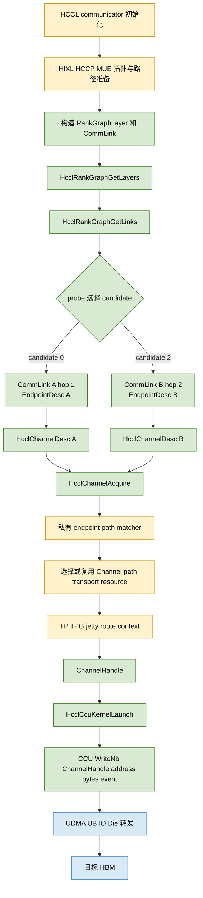

# A5 CCU route2 路径选择定位与显式 relay 改造边界

## 1. 结论

现有证据已经把 route0 与 route2 的路径分叉范围定位到：

```text
communicator 初始化并构造 RankGraph
        |
        |  生成不同 CommLink 和 path-specific EndpointDesc
        v
HcclRankGraphGetLayers / HcclRankGraphGetLinks
        |
        |  probe 只选择已有 candidate，不创建路径
        v
HcclChannelDesc
        |
        |  localEndpoint / remoteEndpoint 不同
        v
HcclChannelAcquire
        |
        |  私有 HCOMM/HCCP/MUE endpoint/path matcher
        v
Channel 内部 path/transport resource
        |
        |  TP/TPG/jetty/route context 的具体组合公开不可见
        v
ChannelHandle
        |
        v
CCU WriteNb
        |
        v
UDMA/UB/IO Die 数据面
```

当前能够严谨确认的**第一处差异**是 RankGraph 发布的 `CommLink`，尤其是完整的
`srcEndpointDesc/dstEndpointDesc`。当前公开追踪没有在 `GET_TP_LIST`、公开 TP attr 或
`WriteNb` 参数中找到稳定的路径 selector。因此，路径不是由 `WriteNb` 临时决定，也不是由应用把整数
`route2` 传给 URMA 后决定。

如果目标是复用 route2 这类已经存在的 forwarding path，不需要修改 UBUS 全局路由表。需要修改或暴露的是：

> **RankGraph 生成之前的 path provisioning，以及 `EndpointDesc -> 私有 path/channel object` 的绑定控制面。**

换句话说，需要让 HIXL/HCCP/MUE 根据 `src、relay、dst` 选择或创建一个 forwarding path object，再为它生成
path-specific endpoint identity 和 `CommLink`；随后现有的 `HcclChannelAcquire -> ChannelHandle -> WriteNb`
数据面可以继续复用。

## 2. route0 与 route2 的编号边界

本文中的 route0/route2 是 probe 对 `HcclRankGraphGetLinks` 返回候选的本地 ordinal：

```text
route0 = candidates[0]
route2 = candidates[2]
```

它们不等于：

- UDMA `route_addr_idx` 0/2；
- UBUS route table index 0/2；
- TP/TPG ID 0/2；
- relay 卡 0/2；
- 用户可写的硬件 path ID。

代码进入 HCOMM 后不会继续传递整数 `0` 或 `2`。继续向下传递的是选中 `CommLink` 的完整 endpoint、协议及
channel descriptor。

## 3. 从 RankGraph 到数据搬运的完整流程



图中绿色节点有公开 API、仓库代码或实机日志支持；黄色节点表示路径建立的私有控制面，正是当前需要暴露或修改的
范围。数据面在获得 `ChannelHandle` 后不再携带 relay 参数。

### 3.1 RankGraph 读取

仓库位置：

- `examples/a5_ccu_urma_route_probe/op_host/utils.cc`
- `EnumeratePaths`
- `SelectRoute`

调用链：

```text
HcclRankGraphGetLayers
  -> 对每个 layer 调 HcclRankGraphGetLinks
  -> 过滤 COMM_PROTOCOL_UBC_CTP
  -> 得到 CommLink candidate
```

这一步是读取 communicator 初始化阶段已经生成的 RankGraph，不是在现场计算或写入物理路由。

### 3.2 从 CommLink 生成 ChannelDesc

当前代码只执行：

```cpp
desc->remoteRank = peer;
desc->notifyNum = CHANNEL_NOTIFY_NUM;
desc->channelProtocol = selectedLink.linkAttr.linkProtocol;
desc->localEndpoint = selectedLink.srcEndpointDesc;
desc->remoteEndpoint = selectedLink.dstEndpointDesc;
```

这里没有 `relayRank`、`nextHop`、`hopList` 或 `route_addr_idx`。route0 与 route2 的稳定公开差异来自选中的
`CommLink`，尤其是两个完整 `EndpointDesc`。

### 3.3 Channel 获取

```text
HcclThreadAcquireWithStream(COMM_ENGINE_CCU)
  -> HcclChannelAcquire(COMM_ENGINE_CCU, HcclChannelDesc)
  -> HcommChannelGetStatus
  -> ChannelHandle
```

`HcclChannelAcquire` 是当前已知分叉输入和数据面句柄之间的关键黑盒。调用 API 相同，但 route0/route2 传入的
`HcclChannelDesc` 不同。底层必须消费这些 endpoint/path 信息，选择或取得不同的内部通信资源。

### 3.4 URMA 与 TP 观察边界

黑箱已经确认：

```text
TpMgr::StartGetTpInfoListRequest
  -> RaGetTpInfoListAsync
  -> RaHdcGetTpInfoListAsync
  -> RsGetTpInfoList
  -> RsUbGetTpInfoList
  -> RsUrmaGetTpList
  -> urma_get_tp_list
  -> ubcore_get_tp_list_helper
  -> ubcore_get_tp_list_from_ops
  -> udma_get_tp_list
  -> MUE firmware
```

UDMA `GET_TP_LIST`：

- service version：1；
- service type：1；
- opcode：`0x21`；
- 请求前 32 字节为 `local_eid[16] + peer_eid[16]`。

公开请求没有 relay rank、next hop 或 hop-list。重复实验中，route0/route2 可得到相同的公开 EID pair、TP
handle 集合和 TP attr。因此 `GET_TP_LIST` 更接近 TP 资源池枚举，不是当前证据下的路径分叉点。

曾观察到的 `urma_import_jfr_ex -> active TP/TPN` 事件必须按 caller stack 排除 Ascend Trace/HDC 基础设施噪声。
在无法证明事件属于单次 `HcclChannelAcquire` 时，不能用这些 TPN 宣称 route0/route2 已稳定绑定不同 TP。

### 3.5 CCU 数据面

数据面只消费已创建的 channel：

```cpp
WriteNb(channel, remoteAddr, localAddr, bytes, event);
WaitEvent(event);
```

`WriteNb` 没有 endpoint、relay、route index 或 hop-list 参数。因此，在执行到它以前，路径必须已经固化在
`ChannelHandle` 引用的内部资源中。

## 4. 路径选择差异可能由哪些参数造成

下面按证据强度排序。列表中的“可能”不等于已经证明可编程。

| 优先级 | 参数或上下文 | 所在阶段 | 当前证据 | 对路径选择的可能作用 |
|---|---|---|---|---|
| P0 | 完整 `srcEndpointDesc` / `dstEndpointDesc` raw | CommLink、ChannelDesc | route0/route2 稳定不同，并原样进入 Acquire | 最可信的 path identity 或 matcher key |
| P0 | `CommAddr.type + CommAddr.eid[16]` | EndpointDesc | 两个 candidate 的完整地址不同 | 指向预配置 endpoint/path identity；不是公开 hop-list |
| P0 | RankGraph layer、link identity、`hop` | CommLink 构造前后 | route0 为 hop-1，route2 为 hop-2 | 参与上游 path provisioning；其中 `hop` 也可能只是描述结果 |
| P0 | communicator 内部 RankGraph/path catalog 上下文 | communicator 初始化 | GetLayers/GetLinks 只读取已发布结果 | 将 endpoint identity 关联到私有 path object |
| P1 | `HcclChannelDesc` 私有/raw 字段 | Acquire 输入 | descriptor raw 随 endpoint 差异变化 | 可能携带公开结构未命名的内部标记 |
| P1 | HCCP/MUE endpoint matcher 的隐式上下文 | Acquire 内部 | 公开 URMA 边界无法解释路径差异 | 很可能选择预配置 Channel/path/TPG 对象 |
| P1 | local/remote EID pair 与 service/trans mode | HCCP 到 MUE | GET_TP_LIST 明确携带 EID pair | 用于查 TP pool；单独不足以解释已观测路径差异 |
| P1 | remote ID、UASID、TPN/TPG、jetty identity | import/connect | 数据结构和部分事件可见，但与 candidate 的稳定绑定未完全证明 | 可能是私有 path object 的资源引用 |
| P2 | `route_addr_idx` | UDMA TP context | 已确认字段存在，未获得 producer/consumer 映射 | 可能索引 MUE/UDMA path/route object |
| P2 | `route_type`、`switch_mp_en`、`lbi` | UDMA TP context | 字段存在，语义与赋值链未知 | 可能区分 forwarding、multipath 或负载均衡模式 |
| P3 | `flow_label`、UDP source port、`spray_en` | TP/packet 属性 | 公开 attr 可见；无显式 relay 语义 | 可能在已有候选出口间 hash/spray，不能创建指定 relay |
| 排除 | probe 的 `routeIndex=0/2` | 测试程序 | 只是数组 ordinal | 不会进入硬件 |
| 排除 | `ChannelHandle` 数值 | Acquire 返回 | opaque handle | 不能从数值推导 TP、relay 或 path |
| 排除 | `sr_en` | TP attr | 已确认是 Selective Retransmission | 不是 source routing |

当前最小、最稳妥的定位是：

```text
路径身份最迟在 ChannelAcquire 返回前确定；
首次可靠差异是 CommLink/EndpointDesc；
实际绑定发生在 RankGraph path provisioning 或 ChannelAcquire 内部 matcher；
公开 GET_TP_LIST 之后没有发现可由应用设置的稳定 selector。
```

## 5. route2 为什么能工作而直接选择 EID 不够

route2 的顺序是：

```text
平台控制面先准备 forwarding path object
  -> 为它生成 path-specific endpoint identity
  -> RankGraph 发布 CommLink
  -> 应用选择 CommLink
  -> HcclChannelAcquire 命中已有 path object
```

直接 EID 实验尝试的是：

```text
应用选择或构造 EID
  -> 希望底层自动推导 relay 和 forwarding path object
```

第二条链缺少 path provisioning 和 endpoint-to-path registration。`urma_get_device_by_eid`、
`urma_create_context` 只能回答本地用户态是否能绑定某个 endpoint identity，不能注册一条
`src -> relay -> dst` 的 forwarding path。

`NOT_VISIBLE` 实验只能证明 RankGraph 使用的部分完整 endpoint identity 没有作为普通用户态本地 EID 暴露；它本身
不是“硬件不能 relay”的证据，也不能说明远端 EID 必须在源卡创建 context。

## 6. 如果不改 UBUS 路由表，显式构造 relay 应该改什么

### 6.1 为什么可以不改全局路由表

黑箱与实机实验已经证明：

- route2 能传输；
- HCCL RankGraph 能发布 hop-2 forwarding CommLink；
- direct 与 forwarding 资源可以并发贡献带宽；
- IO Die transit forwarding 数据面已经存在。

这说明至少一部分 forwarding 路径已经被平台控制面准备好。为了显式复用这些路径，不需要重新写全局
`destination CNA -> egress bitmap`。

需要修改的是“选择或生成哪个既有 forwarding path object，并为上层发布什么 endpoint/CommLink”。

### 6.2 两种实现情况

#### 情况 A：所有需要的 relay path 已经存在，只是没有全部发布

应增加受支持的内部路径目录与选择 API：

```text
EnumeratePathObjects(srcRank, dstRank)
  -> pathHandle
  -> hop count
  -> relay physical rank or physical footprint
  -> local/remote endpoint identity
  -> die/protocol/capacity/status

SelectPathObject(srcRank, dstRank, relayRank)
  -> pathHandle

PublishOrBuildChannelDesc(pathHandle)
  -> CommLink or HcclChannelDesc
```

随后沿用：

```text
HcclChannelAcquire
  -> ChannelHandle
  -> CCU WriteNb
```

这里真正需要改的是 HIXL/HCCP/MUE 的 path catalog 查询与 HCOMM 的 path-object 绑定接口，而不是 CCU kernel。

#### 情况 B：物理 hop 可达，但指定 relay 的 path object 尚未创建

需要增加 per-path 控制面 API：

```text
CreateForwardingPath(
    srcRank,
    relayRank,
    dstRank,
    protocol=UBC_CTP,
    forwardingOnly=true,
    noRelayHbm=true)
  -> pathHandle
  -> localEndpoint
  -> remoteEndpoint
```

平台内部需要：

1. 验证 `src -> relay` 与 `relay -> dst` 已有物理连通性；
2. 在 HCCP/MUE 中组合或分配 forwarding path/TPG/jetty/route context；
3. 注册 path-specific endpoint identity 与该内部对象的匹配关系；
4. 生成可被 HCOMM 消费的 `CommLink` 或 `HcclChannelDesc`；
5. 管理 path lease、引用计数、查询和销毁；
6. 保证 relay 只使用 IO Die 转发，不启动 relay rank 用户进程，不落 relay HBM。

此处“创建 path object”不等于改 UBUS 的全局 reachability 表。底层可以复用已经存在的每跳物理路由，只新增
**per-channel/per-path 的 forwarding 组合和绑定状态**。

### 6.3 建议的最小接口边界

建议把新能力放在 HCOMM 与 HCCP/HIXL 的控制面边界，而不是 Python 或 CCU kernel：

```cpp
struct ExplicitRelayPathRequest {
    uint32_t srcRank;
    uint32_t relayRank;
    uint32_t dstRank;
    CommProtocol protocol;
    uint32_t flags;  // forwarding-only, no-relay-HBM
};

struct ExplicitRelayPathResult {
    uint64_t pathHandle;
    EndpointDesc localEndpoint;
    EndpointDesc remoteEndpoint;
    uint32_t dieId;
    uint32_t hopCount;
};

HcclResult HcommExplicitRelayPathAcquire(
    HcclComm comm,
    const ExplicitRelayPathRequest *request,
    ExplicitRelayPathResult *result);

HcclResult HcommExplicitRelayPathRelease(
    HcclComm comm,
    uint64_t pathHandle);
```

`Acquire` 的 backend 应连接现有 RankGraph/path catalog 和 HCCP/MUE path provisioning；不能通过伪造 EID 或
返回默认 route2 冒充指定 relay 成功。

## 7. 对现有代码应怎样改

### 7.1 不应修改

- 不应给 `WriteNb` 增加一个只在应用层存在的 `relayRank` 参数；数据面无法据此创建路径。
- 不应把 `routeIndex=2` 硬编码成 relay 卡 2。
- 不应把 `route_addr_idx` 猜成 RankGraph ordinal。
- 不应继续把 `GET_TP_LIST` 当作主 selector；它已被证据降级为资源枚举边界。
- 不应仅修改全局 UBUS route table作为生产级 per-channel 选路方案。

### 7.2 应修改

1. **HIXL/HCCP/MUE 控制面**：提供 path object 的枚举、指定 relay 的创建/选择、查询与释放。
2. **HCOMM resource/channel 层**：允许 `HcclChannelAcquire` 绑定一个明确的 `pathHandle`，或消费由该
   pathHandle 生成的 path-specific `EndpointDesc`。
3. **RankGraph 发布层**：可选地把新建 path 发布成带稳定 path identity 和 relay metadata 的 `CommLink`；如果
   不发布，则提供直接从 `pathHandle` 创建 ChannelDesc 的内部接口。
4. **本仓 operator host 层**：把用户的 `relayRank`/path policy 传给新控制面，得到 Channel；继续把
   `ChannelHandle` 传给现有 CCU kernel。
5. **观测与安全层**：返回实际 relay、hop、die、物理 footprint 和 lease；若无法满足指定 relay，必须失败，不能
   静默回退。

现有 CCU 多路径数据面可以继续使用：

```text
channel_direct = acquire(direct pathHandle)
channel_relay  = acquire(explicit relay pathHandle)

WriteNb(channel_direct, directChunk)
WriteNb(channel_relay, relayChunk)
WaitEvent(all)
```

因此工程上的主要缺口不是 AllToAll 切分或 CCU `WriteNb`，而是创建并绑定 `channel_relay` 的控制面。

## 8. 当前进度可以怎样汇报

可以明确汇报：

1. 已完成从 RankGraph 到 CCU 数据面的调用链定位；
2. 已确认 route0/route2 的首次可靠差异是完整 `CommLink/EndpointDesc`，并进入不同
   `HcclChannelDesc`；
3. 已确认路径在 `ChannelHandle` 返回前固化，CCU `WriteNb` 不参与 relay 选择；
4. 已确认公开 `GET_TP_LIST`、TP attr 和 EID context API 没有暴露稳定 relay selector，继续围绕
   `GET_TP_LIST` 无法解决显式选路；
5. 已把未公开分叉范围缩小为 RankGraph path provisioning 与 `HcclChannelAcquire` 内部
   endpoint-to-path matcher；
6. route2 证明现有平台已经具有 forwarding path object 和数据面，不必把修改全局 UBUS route table作为主线；
7. 下一实现点是暴露或补充 HIXL/HCCP/MUE 的 path object 枚举/创建接口，并让 HCOMM Channel 显式绑定
   `pathHandle`。

尚不能声称：

- 已经能够从应用任意指定一张 relay 卡；
- 已经知道 `route_addr_idx`、TPN 或 endpoint raw 的私有编码；
- 任意 `src -> relay -> dst` 的 forwarding path object 都已预创建；
- 用户态只靠 EID 可以构造 source route。

## 9. 证据来源

本文综合以下材料：

- `A5_ROUTE2_VS_DIRECT_EID_ROUTING.md`；
- `docs/A5_CCU_DISCOVERED_PATH_CALL_CHAIN.md`；
- `docs/A5_CCU_DISCOVERED_PATH_ALLTOALL_GUIDE.md`；
- `examples/a5_ccu_urma_route_probe/op_host/utils.cc`；
- `examples/a5_ccu_urma_route_probe/op_kernel_ccu/route_kernel.cc`；
- Ascend950 UB/CCU relay 黑箱交接文档中的 UBUS、ubcore、UDMA/MUE 反汇编结论；
- route0/route2 的 CommLink、ChannelDesc、URMA 边界与物理路径实验结果。

所有“可能字段”均在表格中标记为候选，不把字段名、handle 数值或 ordinal 当作已经证明的硬件语义。
